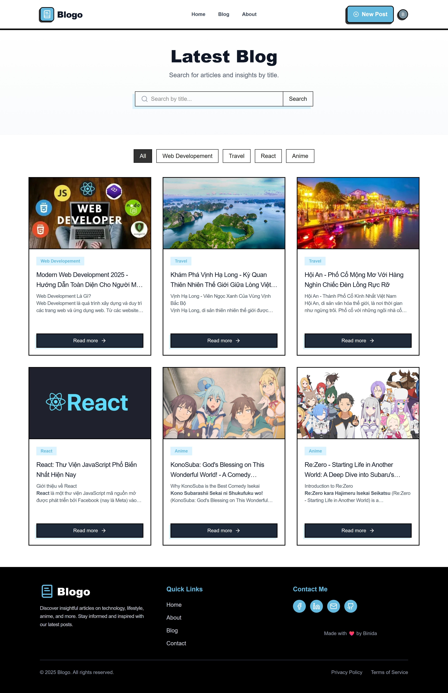
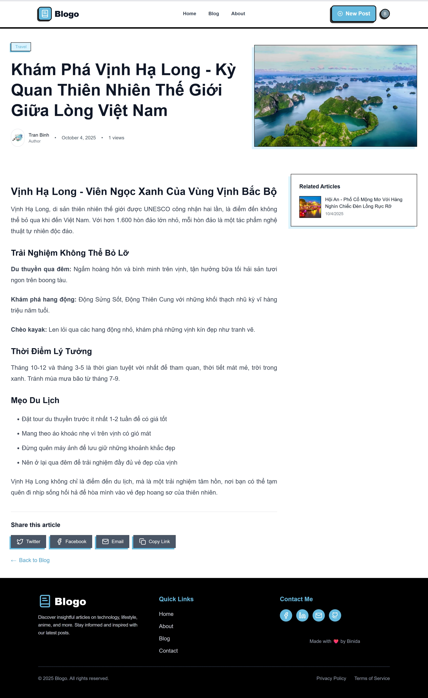
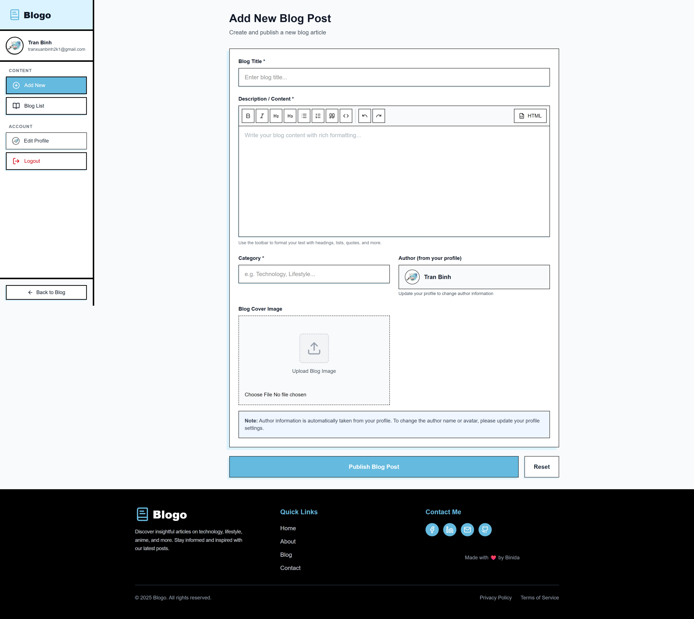

# Blogo

A simple blogging website built with Next.js 15.

## What's This?

A blog platform where you can write and share articles. Has panel dashboard to manage posts.

## Main Features

- User login system
- Write blog posts with text editor
- Upload images
- Search and filter posts
- Share on social media
- Mobile friendly

## Built With

- Next.js 15
- MongoDB (database)
- Clerk (login system)
- Cloudinary (image storage)
- Tailwind CSS (styling)

## Setup

1. Download code

```bash
git clone https://github.com/Binida1210/next_blog.git
cd next_blog
npm install
```

2. Add `.env.local` file with your keys

```env
MONGODB_URI=your_database_url
NEXT_PUBLIC_CLERK_PUBLISHABLE_KEY=your_clerk_key
CLERK_SECRET_KEY=your_secret
CLOUDINARY_CLOUD_NAME=your_cloudinary_name
CLOUDINARY_API_KEY=your_api_key
CLOUDINARY_API_SECRET=your_secret
```

3. Run

```bash
npm run dev
```

Visit: http://localhost:3000

## Screenshots

### Home Page



### Blog Detail



### Dashboard


